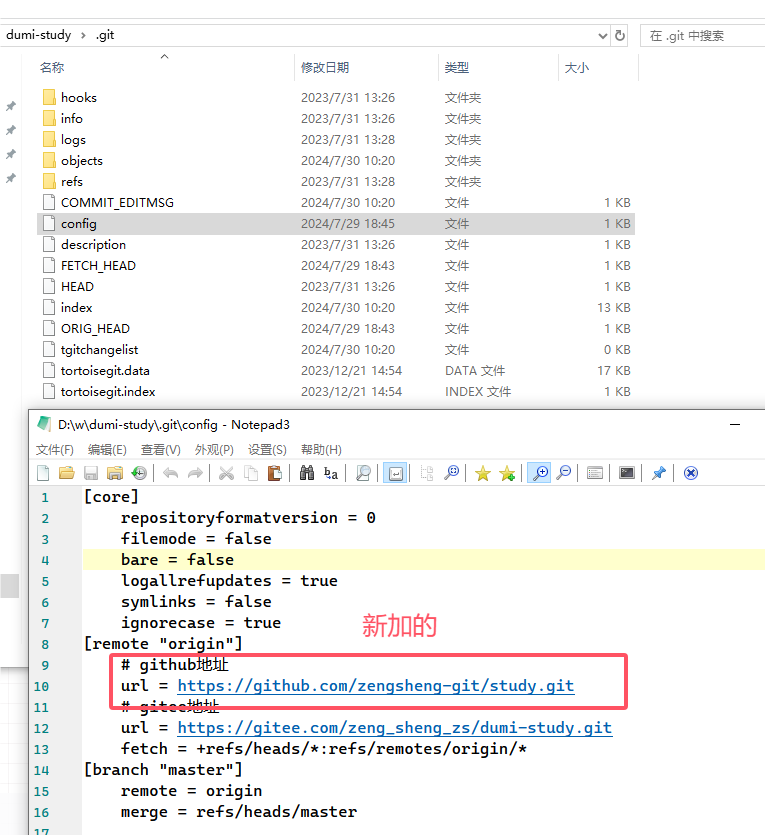

## 命令式上传文件

-   依赖

```json
    "inquirer": "^8.0.0",
    "ora": "^4.0.3",
    "node-ssh": "^7.0.0",
    "archiver": "^3.1.1",
    "chalk": "^3.0.0",
```

## 发送到钉钉机器人

-   依赖

```json
    "dingtalk-robot-sender": "^1.2.0",
```

## "type": "module" 会报错 require is not defined in ES module scope, you can use import instead

-   文件名全改为.cjs

## 测试框架 cypress

-   安装 npm 包就行

```json
"@cypress/vue": "^6.0.0",
"cypress": "^13.7.0",
"cypress-file-upload": "^5.0.8",
```

-   配置 cypress.config.ts
-   复制 tsconfig.json 文件
-   配置 .gitignore 忽略

```file
/cypress/videos/
/cypress/screenshots/
/cypress/report/
```

-   运行 `yarn cypress:open`

## cypress 生成测试报告

-   在以cypress run运行时，如果出现失败，会自动进行截图，并保存至默认目录：cypress\screenshots和cypress\videos。在使用cypress open 不会自动截图。
-   参考链接 https://blog.csdn.net/weixin_39929465/article/details/111852768
-   安装 npm 包就行

```json
  "mocha": "^10.3.0",
  "mochawesome": "^7.1.3",
  "mochawesome-merge": "^4.3.0",
  "mochawesome-report-generator": "^6.2.0",
```

-   配置 cypress.config.ts
-   命令 `yarn cypress:run`
-   报告在 `cypress/reports` 目录下
-   错误截屏在 `cypress/screenshots` 目录下
-   错误录屏在 `cypress/videos` 目录下

## cypress cloud 使用

-   在 cypress.config.ts 添加 `projectId`
-   修改 `cypress:run` 命令添加 key

```json
"cypress:run": "cypress run  --record --key XXXXXXXXXXXXXXXXXXXXXX",
```

## 提交代码自动格式化

-   添加依赖 和 prettier规则，prettier忽略规则

```json
"prettier": "^3.2.4",
"husky": "^7.0.4",
"lint-staged": "^15.2.2",
```

-   添加命令

```json
        "prepare": "husky install",
        "lint-staged": "lint-staged",
```

-   添加lint-staged规则

```json
 "lint-staged": {
        "**/*.{js,jsx,tsx,ts,less,md,json,scss,vue,css}": [
            "prettier --write",
            "git add"
        ]
    },
```

-   在 `.husky` 文件夹 添加 `pre-commit` 文件

```sh
#!/bin/sh
. "$(dirname "$0")/_/husky.sh"
npx --no-install lint-staged
```

## 前端工程化并行解决方案 concurrently

```json
"dev": "concurrently \"npm run vite\" \"npm run dev:docs\"",
```

## Luckysheet的使用

-   [文档][Luckysheet文档]
-   在html中引入

```html
<link rel="stylesheet" href="https://cdn.jsdelivr.net/npm/luckysheet/dist/plugins/css/pluginsCss.css" />
<link rel="stylesheet" href="https://cdn.jsdelivr.net/npm/luckysheet/dist/plugins/plugins.css" />
<link rel="stylesheet" href="https://cdn.jsdelivr.net/npm/luckysheet/dist/css/luckysheet.css" />
<link rel="stylesheet" href="https://cdn.jsdelivr.net/npm/luckysheet/dist/assets/iconfont/iconfont.css" />
<script src="https://cdn.jsdelivr.net/npm/luckysheet/dist/plugins/js/plugin.js"></script>
<script src="https://cdn.jsdelivr.net/npm/luckysheet/dist/luckysheet.umd.js"></script>
```

-   使用

```javascript
useEffect(() => {
    const luckysheet = window.luckysheet;
    luckysheet.create({
        container: "luckysheet",
        plugins: ["chart"],
        title: "filename", // 设定表格名称
        data: [], // 设定表格数据
    });
}, []);
```

## 集成 univerjs

-   安装依赖

```json
{
    "@univerjs/core": "^0.1.3",
    "@univerjs/design": "^0.1.3",
    "@univerjs/docs": "^0.1.3",
    "@univerjs/docs-ui": "^0.1.3",
    "@univerjs/engine-formula": "^0.1.3",
    "@univerjs/engine-numfmt": "^0.1.3",
    "@univerjs/engine-render": "^0.1.3",
    "@univerjs/facade": "^0.1.4",
    "@univerjs/network": "^0.1.4",
    "@univerjs/protocol": "^0.1.13",
    "@univerjs/rpc": "^0.1.3",
    "@univerjs/sheets": "^0.1.3",
    "@univerjs/sheets-formula": "^0.1.3",
    "@univerjs/sheets-numfmt": "^0.1.3",
    "@univerjs/sheets-ui": "^0.1.3",
    "@univerjs/ui": "^0.1.3",
    "@univerjs/uniscript": "^0.1.3",

    "@wendellhu/redi": "^0.13.0",
    "monaco-editor": "^0.47.0",
    "react": "^18.2.0",
    "react-dom": "^18.2.0"
}
```

-   [参考项目][univerjs项目示例]


## gitee和githup代码同步
- 修改 gitee项目下面的 .git/config 文件,增加一个githup地址
  
- [参考资料][gitee和githup代码同步]


## gh-pages 自动把代码同步到 gh-pages分支，并部署静态页面
- 新建分支 gh-pages
- 安装插件   `pnpm add gh-pages -d`
- 根据githup pages 提供的域名，修改打包配置 `base` 和 `publicPath`，一版修改为仓库名
``` json
base: "/study", // 文档起始路由
publicPath: process.env.NODE_ENV === 'production' ? '/study/' : '/' , // 静态资源起始路径
```
- 配置package.json命令
``` json
// 自动同步到代码gh-pages分支
"deploy_gitee": "gh-pages -d dist",
// 自动同步到代码 gitgup 上面的 gh-pages分支
"deploy": "gh-pages -d dist -r https://github.com/zengsheng-git/study.git -b gh-pages && pnpm run deploy_gitee",
```
- [参考资料][githup pages的使用]


## 宝塔配置 非根目录部署
- 不需要如下配置,应该删掉,根目录部署需要，防止刷新404
``` sh
     location / {
       try_files $uri /index.html;
     }
```
- 其余配置不变
- 打包需要配置`base` 和 `publicPath`

---

[Luckysheet文档]: https://mengshukeji.gitee.io/LuckysheetDocs/zh/guide/config.html#%E9%85%8D%E7%BD%AE%E9%A1%B9
[univerjs项目示例]: https://univer.ai/playground/?title=Uniscript
[gitee和githup代码同步]: https://cloud.tencent.com/developer/article/2372244
[githup pages的使用]: https://blog.csdn.net/weixin_52017993/article/details/133784617
